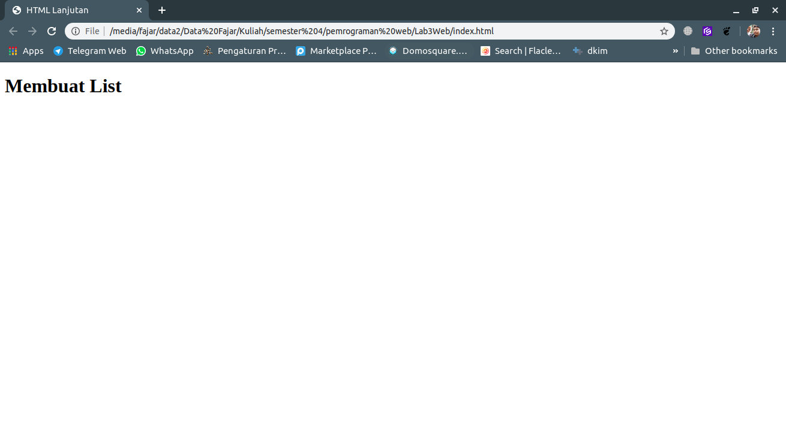
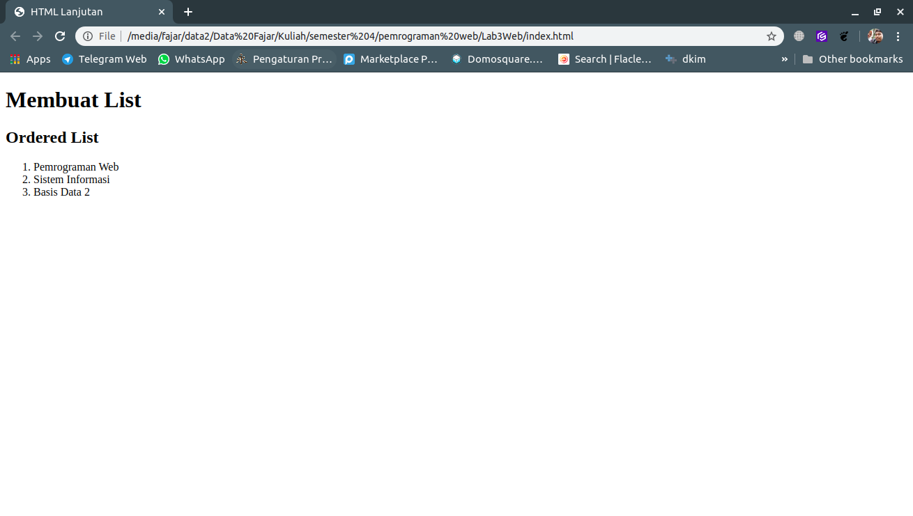
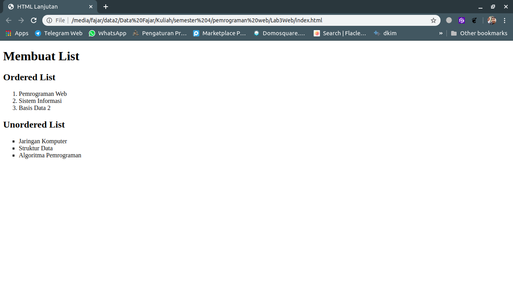
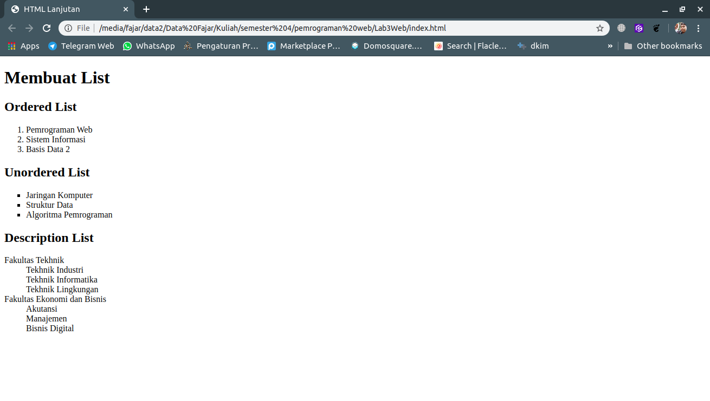
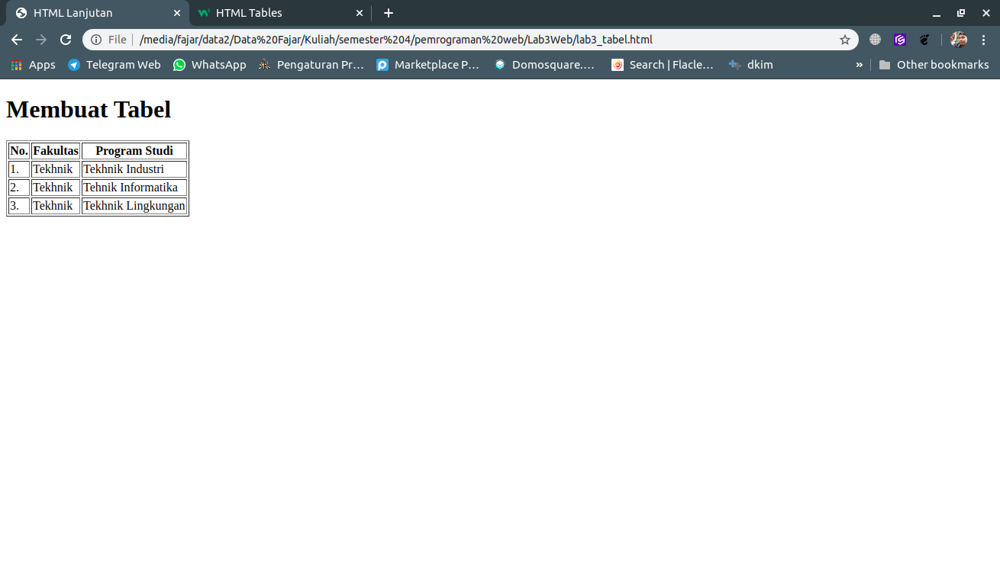
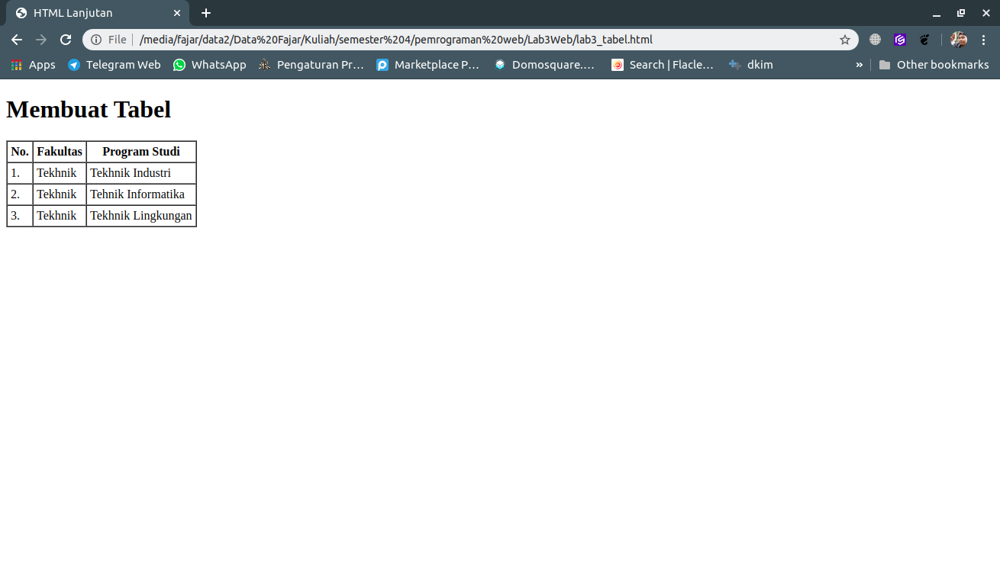
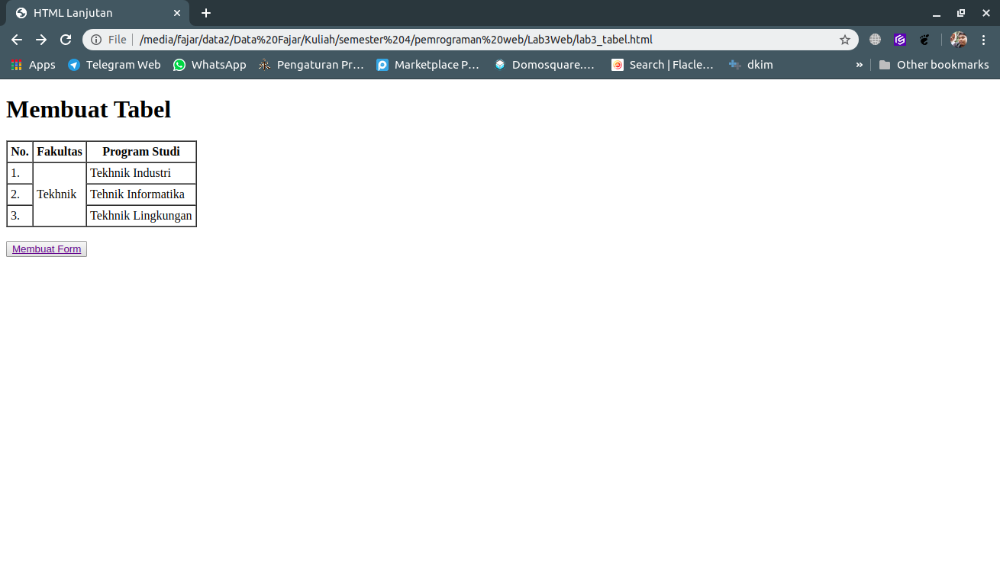
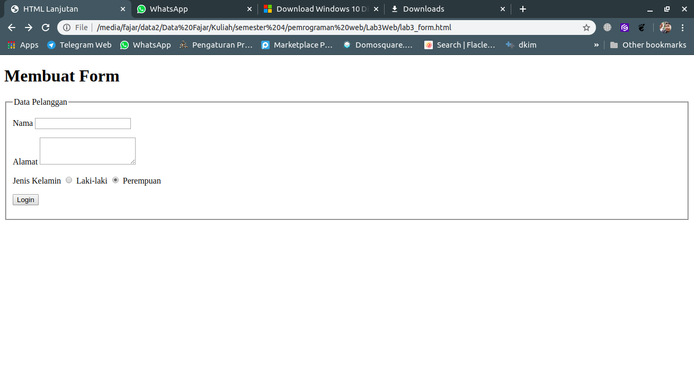
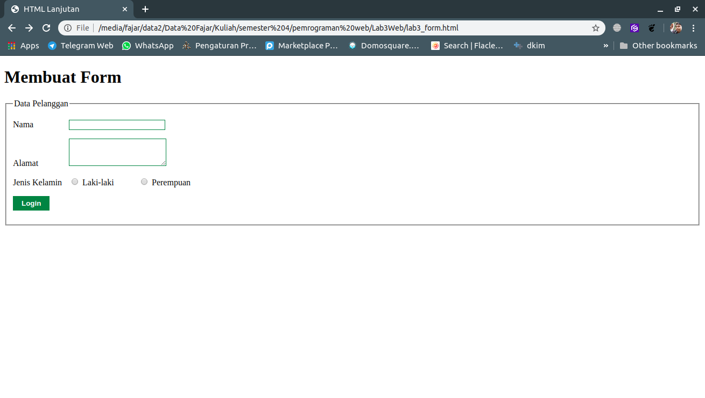
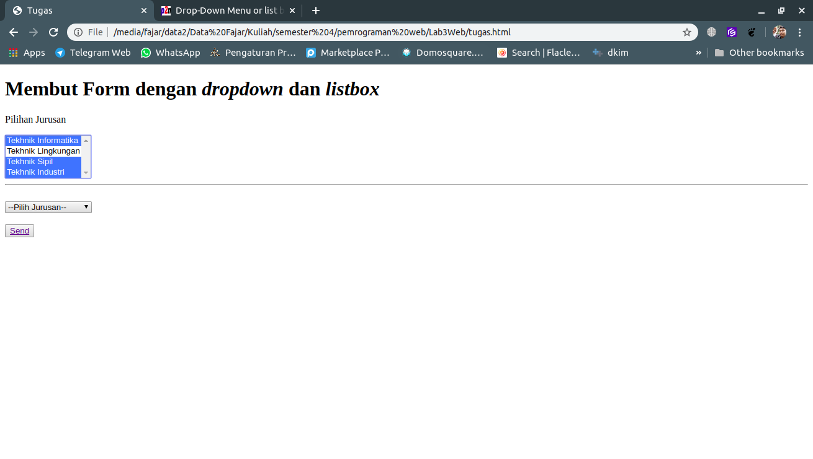

Fajar Arif Riyanto  
311910666  
TI 19 B2

1. Membuat dokumen HTML   
     

2. Menambahkan kode untuk membuat ordered list
    

3. Menambahkan kode untuk membuat unordered list.
    

4. Membuat description list pada file html.
     

5. Membuat file html baru dengan nama 'lab3_tabel.html' dan tambahkan kode untuk membuat tabel sederhana.
    

6. Mengatur margin dan padding pada tabel.
      

7. Menggabungkan cell data dengan atribut rowspan.  
      

8. Membuat file html baru dengan nama 'lab3_form.html' dan tambahkan kode untuk membuat form sederhana.
    

8. Membuat file external css untuk membuat tampilan form lebih menarik.
    

**Jawaban Pertanyaan dan Tugas**

Membuat Form yang menampilkan Dropdown menu dan listbox dengan multiple selection. source code dengan nama tugas.html.   
    
